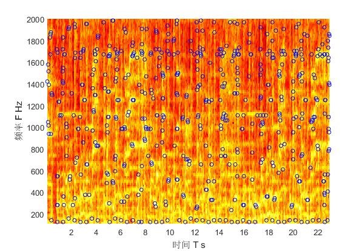
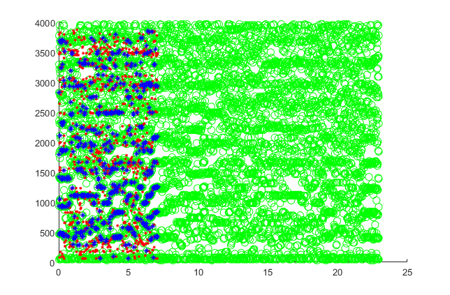
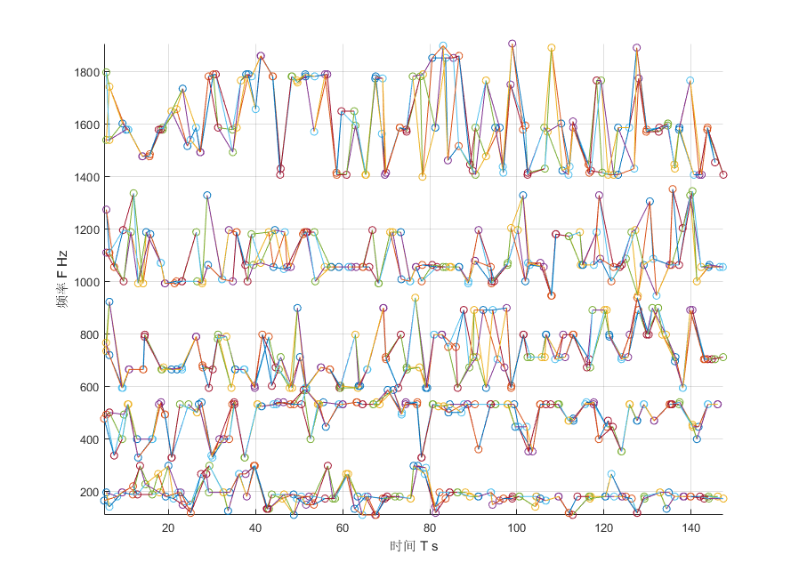

# ocicat-afpj
奥西签到中用Java实现的音频指纹算法。

* **研究性质程序**
* **我不是写Java的，写得不好请见谅**

## 算法说明
1. 使用离散短时傅里叶变换 [Discrete-time STFT](https://en.wikipedia.org/wiki/Short-time_Fourier_transform)，窗函数选择 [Hamming 窗](https://en.wikipedia.org/wiki/Window_function#Hann_and_Hamming_windows)，作出输入音频的 [频谱](https://en.wikipedia.org/wiki/Spectrogram)，并求取功率极大值点：

2. 去掉落在人耳听觉范围之外的极大值点，并按照[梅尔刻度](https://zh.wikipedia.org/wiki/%E6%A2%85%E5%B0%94%E5%88%BB%E5%BA%A6)划分频带，在时域上按固定值划分时间段。
3. 将每个频带-时间段区域内的极值点按功率排序，选取前N个功率最大的极值点，标记在频谱图上作散点图。
4. 以原音频的散点图为底，录音音频样本的散点图在其上按时间方向滑动，录音音频样本与原音的某段在散点图上有大量重合：

5. 虽然可以存储散点图作为音频指纹，但是样本音频的开始时间不定、散点搜索性能低，所以要选用与时间无关、搜索简易的特征作为指纹。
6. 同频带内在时间轴上，将每一区域所选取的点与下一区域的点两两求差，得到dt、df，并将这两个数字混合为一个值，使用这些值集合作为音频指纹。在频谱图上，这些值可以看作极值点之间的连线：

## 使用说明
需要使用 JDK8 + IntelliJ IDEA 进行编译，参数可以写在 afpj.properties 中。

先复制一份 fp.bak.db 到 fp.db，将原音频放在 ocicat/ 目录下，将样本音频放在 sample_songs/ 下，创建文件夹 logs/ 存放识别日志（都可以在 afpj.properties 中指定）。

### 参数
* `-p afpj.properties i`: 进行指纹生成，指纹存在 fp.db 中。
* `-p afpj.properties s`: 进行音频搜索，搜索结果将进行打印并存在日志文件夹中。
* `-p afpj.properties v xxx.wav`: 查看某音频的简易极值散点图，用于调试。

## 参考
* [An Industrial-Strength Audio Search Algorithm](https://www.ee.columbia.edu/~dpwe/papers/Wang03-shazam.pdf)